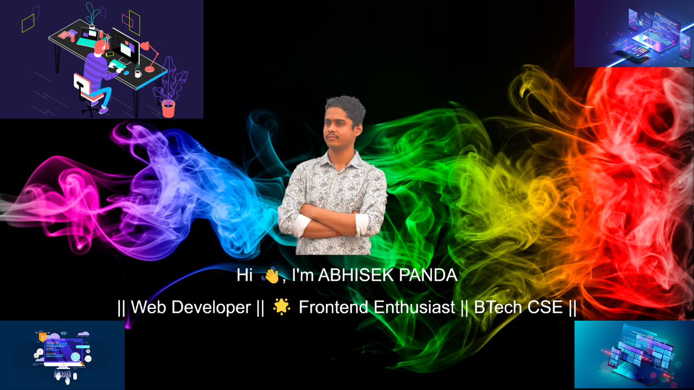
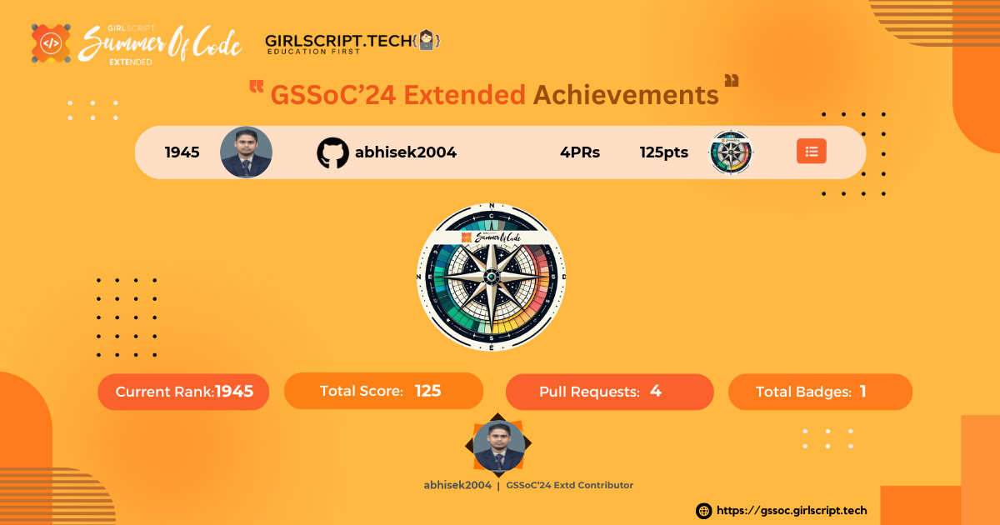

<!---->

<!-- <h3 align="center"> MERN , JAVA & DSA || Web Developer || 🌟 Frontend Enthusiast || BTech CSE</h3> -->
<!--  -->

    

<!--  -->

<!-- Night Owl image -->
<!--

  

-->

<!--<h1 align="center">Hi 👋, I'm ABHISEK PANDA</h1>-->

  
    

  

  

### 🌟 **MERN, Java & DSA** | CSE Final Year | Tech Innovator

  
  
  

 

"Hi I’m 𝐀𝐛𝐡𝐢𝐬𝐞𝐤, My name signifies 'anointing' or 'consecration.' I’m on a journey to build a fulfilling career with dedicated and passionate people who can help me discover my potential. I’m excited to be a key player in a creative and dynamic environment, using my skills to make a positive impact along the way."

### 
My Technical Skills

  

  

    

### 🌟 About Me

<i>&nbsp;
✨ "Embrace every challenge with optimism, and let hope light the way!" ✨</i>  

  

👨‍🎓 I’m currently pursuing a **Bachelor of Technology** in **Computer Science** at **GIET University, Gunupur**. My journey in tech is fueled by a passion for mastering the **MERN Stack**, along with skills in **Java**, and **Data Structures & Algorithms**.

🏫 My academic path began at **St. Xavier's Sr. Secondary School, Jajpur Road**, where I completed both my Intermediate and Matriculation. I thrive on setting ambitious goals and constantly seek opportunities for growth and innovation.

🔥 &nbsp; With an impressive following of 5k+ followers on [Linkedin](https://www.linkedin.com/in/abhisekpanda2004/).

🏆 **Trophies - 28**, **Badges - 106** on [Microsoft Learn](https://learn.microsoft.com/en-us/users/AbhisekPanda-1209). These accomplishments reflect my dedication to continuous learning, skill development, and commitment to mastering new technologies.

💬 One of my key strengths is effective communication, which helps me collaborate seamlessly within teams. I am goal-oriented and strive for excellence, fostering a supportive environment for collective success.

🎨 I have a passion for crafting immersive user experiences through **frontend development**. Embracing challenges is part of my journey, and I’m eager to contribute my skills to impactful projects.

🚀 I’m on the lookout for opportunities where I can bring my determination and commitment to teamwork, with aspirations to make meaningful contributions in the world of web development. My dream companies include **Samsung**/ **TCS**.

  
🏆 Certificates

   

📄 Below is a showcase of my knowledge and skills across a wide range of Competitive Programming and Development.
 

| S.No. | Achievement Name           | Issuing Authority |       Date        | Details                                                                                                                                                                       | Credential |
| :---: | :------------------------- | :---------------: | :---------------: | :---------------------------------------------------------------------------------------------------------------------------------------------------------------------------- | :--------- |
|  1.   | GSSOC’24 🎉💻             |   GSSOC’24 EXT 🎉🚀    | Oct '24 - Nov '24          | Actively contributing to open-source projects 🌐💻 (04 PRs accepted ✅), showcasing development skills and gaining practical experience 🎯🔧. Ranked 1945 in GSSOC’24 EXT 🚀🏆💡🌟 | [View](https://drive.google.com/file/d/13KGKct_ihd2EXeVoHCrI3ySilN1PtX7C/view?usp=sharing)   |
|  2.   | 🎉 MERN course            |   Apna College! 🚀📚    | Sept '23 - July '24       | The course provided a deep dive into the MERN stack (HTML, CSS, JavaScript, MongoDB, Node.js, React, and Express.js) 🖥️💻, greatly enhancing my coding skills 💪👨‍💻 and problem-solving abilities 🔍🧠. It was an amazing learning experience 🚀🌟, and I feel more confident in building full-stack applications 📈💼!  | [View](https://drive.google.com/file/d/1-sKJpbls1a9jpjSrI-c0pglvs-0LcJFA/view?usp=sharing)   |
|  3.   | 🎉 Java DSA course        |   Apna College 🚀📚    | Oct '23 - Sept '24         | The Java programming course 🖥️💡 provided a deep dive into data structures and algorithms 📚🔢, significantly enhancing my coding skills 💻💪 and problem-solving abilities 🧠🔍. It was an incredible journey 🚀, and I'm now more confident in tackling complex coding challenges 💡💥! Ready to take on real-world projects 💼📈🌟! | [View](https://drive.google.com/file/d/1ee6SAK7L5u312LzQudtqOKH7qe0dlznr/view?usp=sharing)   |
|  4.   | 🎉 Backend Development Course        |   Physics Wallah 🚀📚    | 3rd March 2024         | The course was incredibly rewarding, offering in-depth learning and hands-on experience in Backend Development 🚀, JavaScript 💻, JavaScript Superpowers ⚡️, NodeJS 🧩, MongoDB 📊, REST APIs 🌐, and Express JS 🛠️, and I’m immensely grateful to the instructors and the Physics Wallah community for their support 🌍🙏. 💼📈🌟! | [View](https://drive.google.com/file/d/1eron6MRiXYx1wVnVJohw03YWhF0v5g7D/view?usp=sharing)   |
|  5.   | 🎉 Python (Basic) course        |   HackerRank 🚀📚    | 26 May 2024  | I successfully completed the Python (Basic) Certificate Test on May 24, 2024 🎉,🏅, showcasing my foundational proficiency in Python 🐍💻. 💼📈🌟! | [View](https://drive.google.com/file/d/14gyM4XUWeTRKc31VuvQyVbNGglxdY4wG/view?usp=sharing)   |
|  6.   | 🎉 Java Basic course        |   HackerRank 🚀📚    | 26 May 2024         | This certification demonstrates my proficiency in Java fundamentals, paving the way for exciting opportunities in software development 🚀💻🎉🌟📚💡👨‍💻👩‍💻🎯🔧🚀 Keep leveraging your skills and exploring new horizons in the world of programming! 🌍💻💪 | [View](https://drive.google.com/file/d/18hEGWNeext5AgJQ23DBAyVFXfWMoeyze/view?usp=sharing)   |
|  7.   | 🎉 CSS course        |    HackerRank 🚀📚    | 26 May 2024     | I'm excited to share that I've gained proficiency in **Cascading Style Sheets (CSS)** 🎨💻🌟! This marks a significant milestone in my journey toward mastering web design and development 🚀👨‍💻👩‍💻. I’m proud of how far I’ve come, and I can’t wait to continue pushing myself further 💪💡📐🎯. On to the next challenge—let’s keep this momentum going! 🙌🎉 | [View](https://drive.google.com/file/d/1tK3HEWY2JC3d1GR6-9UAMiwURG7YgrfH/view?usp=sharing)   |
|  8.   | 🎉 Full Stack Web Development With MERN STACK & GenAI 2025       |    Udemy 🚀📚    | 05 FEB 2025     |  I’m thrilled to share that I’ve completed the Full Stack Web Development with MERN Stack & GenAI course in 2025, as taught by Masyntech Coding School and Aditya Mandal on Udemy! 🎉💻 This certificate reflects the hard work and dedication I’ve put into mastering the MERN stack, along with GenAI technologies. 🚀👨‍💻👩‍💻 It's been an amazing journey, and I'm excited to continue growing as a developer, creating dynamic and powerful web applications. 💡💪 On to the next challenge! 🙌 | [View](https://www.udemy.com/certificate/UC-30befd4c-e71a-47a2-9750-5e95567b3cd2/?utm_campaign=email&utm_medium=email&utm_source=sendgrid.com)   |
|  9.   | 🎉  100 Days of Code: The Complete Python Pro Bootcamp      |    Udemy 🚀📚    | 05 FEB 2025     | I’m excited to announce that I’ve completed the **100 Days of Code: The Complete Python Pro Bootcamp** on 02/05/2025, as taught by **Dr. Angela Yu**, Developer and Lead Instructor on Udemy! 🎉💻 This accomplishment marks a huge step in my journey to mastering Python and programming fundamentals 🚀👨‍💻👩‍💻. The certificate confirms that I’ve completed the full course, and I’m thrilled with the progress I’ve made! 💪💡 Onward to even bigger challenges as I continue to grow and apply what I’ve learned! 🙌🎯 | [View](https://www.udemy.com/certificate/UC-c4dca015-3705-4d60-ac84-2589f382c326/?utm_campaign=email&utm_medium=email&utm_source=sendgrid.com)   |

  
<strong>
    "🎓 College. ☕️ Coffee. 💻 Code. Repeat."
      
    Vibing to: 🎧
  </strong>

<h2 align="center">🏆 Github Profile Trophy</h2>

<a href="https://github-profile-trophy.vercel.app/?username=abhisek2004&no-bg=true">

<h2 align="center">📈 Cᴏɴᴛʀɪʙᴜᴛɪᴏɴ BAR 📈</h2>

  

## 🏆 GSSoC 2024 Extended Badge🪶✨

	
 
<b>GSSOC(24) Badges 🪶</b>
 

    
<b>GSSOC(24)Extended Badge🪶✨</b>
 
      

    
    
Badge 1: Beginner

  
  
  
  

    
  <!--
  
  
  
  
  -->

<h3> 📱 Social 🌐 </h3>
<table>
    <tr>
        <td><strong>CodePen</strong></td>
        <td>
            
        </td>
    </tr>
    <tr>
        <td><strong>CodeChef</strong></td>
        <td>
            
        </td>
    </tr>
    <tr>
        <td><strong>HackerRank</strong></td>
        <td>
            
        </td>
    </tr>
    <tr>
        <td><strong>Codeforces</strong></td>
        <td>
            
        </td>
    </tr>
    <tr>
        <td><strong>LeetCode</strong></td>
        <td>
            
        </td>
    </tr>
    <tr>
        <td><strong>HackerEarth</strong></td>
        <td>
            
        </td>
    </tr>
    <tr>
        <td><strong>Discord</strong></td>
        <td>
            
        </td>
    </tr>
    <tr>
        <td><strong>GeeksforGeeks</strong></td>
        <td>
            
        </td>
    </tr>
<!--     <tr>
        <td><strong>Codolio</strong></td>
        <td>
            
        </td>
    </tr> -->
<!--     <tr> -->
<!--         <td><strong>Coding Ninjas</strong></td>
        <td>
            
        </td> -->
<!--     </tr> -->
<!--     <tr>
        <td><strong>Dev.to</strong></td>
        <td>
            
        </td>
    </tr> -->
</table>

  <h2 style="color: #2e8b57;">🌟 Trying to Touch and Learn 1 New Thing Everyday! 🌟</h2>
  

    🌱 Embrace the adventure of learning and personal growth.
    ✨ Let my curiosity lead to exciting new horizons!
  

  

    <h1>
        
    </h1>

<!--   -->
<h3> 💻 Languages, Tools and Technologies 🚀  </h3>

<table>
    <tr>
        <td><strong>Programming Languages</strong></td>
        <td></td>
    </tr>
    <tr>
        <td><strong>Database Technologies</strong></td>
        <td></td>
    </tr>
    <tr>
        <td><strong>Frontend Technologies</strong></td>
        <td></td>
    </tr>
    <tr>
        <td><strong>Backend Development</strong></td>
        <td></td>
    </tr>
    <tr>
        <td><strong>Developer Tools</strong></td>
        <td></td>
    </tr>
    <tr>
        <td><strong>Design Tools</strong></td>
        <td></td>
    </tr>
<tr>
        <td><strong>Deployment Platforms</strong></td>
        <td></td>
    </tr>
<tr>
    <td><strong>Operating Systems</strong></td>
    <td></td>
</tr>    
</table>
 

<h3>Holopin badges👀 </h3>
 
  

 📊 GitHub Stats 📊

<!--<h2 align="center">📊 Gɪᴛʜᴜʙ Sᴛᴀᴛs 📊</h2>-->
<table width="100%">
  <tr>
    <td width="50%">
      <h3 align="center"><strong>Rᴇᴘᴏs Pᴇʀ Lᴀɴɢᴜᴀɢᴇ</strong></h3>
      

        
      

        
<!--   <h3 align="center"><strong>Mᴏsᴛ Cᴏᴍᴍɪᴛ Lᴀɴɢᴜᴀɢᴇ</strong></h3>
      

        
      
 -->
        
   <h3 align="center"><strong>Sᴛᴀᴛs</strong></h3>
      

        
      

  <h3 align="center"><strong>Pʀᴏᴅᴜᴄᴛɪᴠᴇ Tɪᴍᴇ</strong></h3>
      

        
      

  
 <!--  <h3 align="center"><strong>Additional Stats</strong></h3> -->
<!--       

        
      
 -->
      
   <h3 align="center"><strong>Pʀᴏfɪʟᴇ Dᴇᴛᴀɪʟs</strong></h3>
      

        
      

    <h3 align="center"><strong>Wake Time Working</strong></h3>
       

          
      

    </td>
   <td width="50%">
<h3 align="center"><strong>GitRoll Profile</strong></h3>

  

  <h3 align="center"><strong>GitHub Stats</strong></h3>
      

        
      

   <h3 align="center"><strong>Streak Stats</strong></h3>
      

        
      
          
  <h3 align="center"><strong>🔝 Top Contributed Repo</strong></h3>
      

        
      

    </td>
  </tr>
</table>

<!--------------------------------------------------------------------------------------------------------------------------------------------------------->
<!--- Abhisek's Coding Profiles   ----------------------------------------------------------------------------------------------------------------------------->
<!--------------------------------------------------------------------------------------------------------------------------------------------------------->
## Coding Profiles📈

  

<h1>My Leet Code Badges 🎖️</h1>

<table style="width:100%; border: 1px solid #ddd; border-collapse: collapse;" align="center">
  <tr>
    <td style="border: 1px solid #ddd; padding: 10px; text-align: center;">
      
    </td>
    <td style="border: 1px solid #ddd; padding: 10px; text-align: center;">
      
    </td>
    <td style="border: 1px solid #ddd; padding: 10px; text-align: center;">
      
    </td>
    <td style="border: 1px solid #ddd; padding: 10px; text-align: center;">
      
    </td>
    <td style="border: 1px solid #ddd; padding: 10px; text-align: center;">
      
    </td>
  </tr>
  
  <tr>
    <td style="border: 1px solid #ddd; padding: 10px; text-align: center;">
      
    </td>
    <td style="border: 1px solid #ddd; padding: 10px; text-align: center;">
      
    </td>
    <td style="border: 1px solid #ddd; padding: 10px; text-align: center;">
      
    </td>
    <td style="border: 1px solid #ddd; padding: 10px; text-align: center;">
      
    </td>
    <td style="border: 1px solid #ddd; padding: 10px; text-align: center;">
      
    </td>
  </tr>
  
  <tr>
    <td style="border: 1px solid #ddd; padding: 10px; text-align: center;">
      
    </td>
    <td style="border: 1px solid #ddd; padding: 10px; text-align: center;">
      
    </td>
    <td style="border: 1px solid #ddd; padding: 10px; text-align: center;">
      
    </td>
    <td style="border: 1px solid #ddd; padding: 10px; text-align: center;">
      
    </td>
    <td style="border: 1px solid #ddd; padding: 10px; text-align: center;">
      
    </td>
  </tr>
  
  <tr>
    <td style="border: 1px solid #ddd; padding: 10px; text-align: center;">
      
    </td>
    <td style="border: 1px solid #ddd; padding: 10px; text-align: center;">
      
    </td>
    <td style="border: 1px solid #ddd; padding: 10px; text-align: center;">
      
    </td>
    <td style="border: 1px solid #ddd; padding: 10px; text-align: center;">
      
    </td>
  </tr>
  <tr>
    <td style="border: 1px solid #ddd; padding: 10px; text-align: center;">
      
    </td>
    <td style="border: 1px solid #ddd; padding: 10px; text-align: center;">
      
    </td>
    <td style="border: 1px solid #ddd; padding: 10px; text-align: center;">
      
    </td>
  </tr>
</table>

<h1>My Hackerrank Badges 🎖️</h1>

<table style="width:100%; border: 1px solid #ddd; border-collapse: collapse;" align="center">
  <tr>
    <td style="border: 1px solid #ddd; padding: 10px; text-align: center;">
      
    </td>
    <td style="border: 1px solid #ddd; padding: 10px; text-align: center;">
      
    </td>
    <td style="border: 1px solid #ddd; padding: 10px; text-align: center;">
      
    </td>
    <td style="border: 1px solid #ddd; padding: 10px; text-align: center;">
      
    </td>
    <td style="border: 1px solid #ddd; padding: 10px; text-align: center;">
      
    </td>
  </tr>
</table>

<h1>My GeeksforGeeks Badges 🎖️</h1>

<table style="width:100%; border: 1px solid #ddd; border-collapse: collapse;" align="center">
  <tr>
    <td style="border: 1px solid #ddd; padding: 10px; text-align: center;">

    </td>
  </tr>
</table>

<h1>My Coding Ninjas Badges 🎖️</h1>

<table style="width:100%; border: 1px solid #ddd; border-collapse: collapse;" align="center">
    <tr>
        <td style="border: 1px solid #ddd; padding: 10px; text-align: center;">
 
             
        x18 ( ACHIEVER )
    </td>
        <td style="border: 1px solid #ddd; padding: 10px; text-align: center;">
 
              
        x17 (SPECIALIST)
    </td>
      <td style="border: 1px solid #ddd; padding: 10px; text-align: center;">
   
            
        x16 (MASTER)
</td>
  </tr>
</table>

<td width="50%">
  <h3 align="center"><strong>Lᴀᴛᴇsᴛ Pʀᴏᴊᴇᴄᴛ</strong></h3>
  

  

</td>

<!--Contribution Graph-->
<h2 align="center">📈 Cᴏɴᴛʀɪʙᴜᴛɪᴏɴ Gʀᴀᴘʜ 📈</h2>

    

<!--Dynamic Quote card updates everyday at 12 PM--> 
<h2 align="center">🌟 Tʜᴏᴜɢʜᴛ ᴏғ ᴛʜᴇ Dᴀʏ 🌟</h2>

<!--STARTS_HERE_QUOTE_CARD-->

    

<!--ENDS_HERE_QUOTE_CARD-->

<!--Contact Section--> 

<h2 align="center">🤝 Cᴏɴɴᴇᴄᴛ Wɪᴛʜ Mᴇ 🤝 </h2>

  

 

  

  

  

<!--Footer--> 

  

